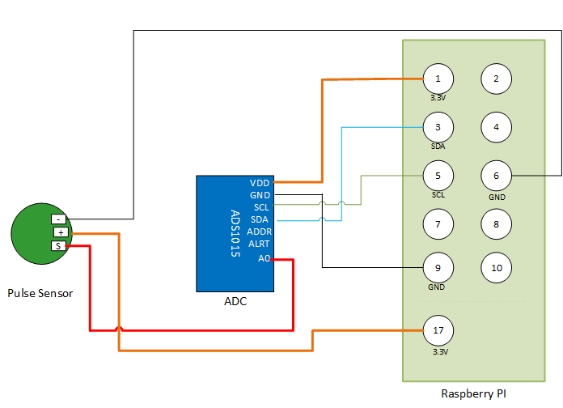

# Heart-pulse-monitoring-system-with-Real-time-streaming-and-visualization-with-Raspberry-Pi-3

# Objective
The aim of this project is to monitor the heart pulse and then to synchronize it in real-time in a web platform which eventually will increase the flexibility and portability.

# Introduction 
This project is a simple heart pulse monitoring system with the help of pulse sensors and raspberry pi 3b+, and this combination is done with the help of an analog to digital converter. Then it visually represents the taken data from the user in real-time as well as sync it in a web platform – “Initial State”.

# Equipment:

Hardware:
1 Raspberry pi 3b+
2 Pulse Sensor
3 Jumper wires
4 Ethernet Cable (for initial setup)
5 Analog to Digital converter (ADS 1015)

Software:
1 Raspbian OS
2 Etcher
3 Pycharm
4 Putty
5 VNC Viewer
6 Initial State’s API

# Working Algorithm:

1. Initial setup of Raspbian Pi OS
2. Connections of the pulse sensor and Raspberry pi have to done perfectly using the Analog to Digital converter which will connect these two platforms
3. Testing of the pulse sensor and analog to digital converter by connecting according to the working diagram mentioned below
4. Then, heartbeat.py script from the Raspberry Pi has to be executed
5. Tip of the finger has to be placed on the pulse sensor
6. Step 4 will show the pulse in the Raspberry Pi’s terminal
2
7. In the background, the data collected from step 6, will be uploaded in real-time Initial State’s web interface
8. The script of step 3 will use the bucket key and the access key to connect our code to the Initial State’s API
9. By using step 6 and 7, the data collected from step 3 will be shown on the Initial State’s web interface and also will be saved in their database for the future reference

# Working Diagram

# Result and discussion 
The main target of this project was to collect the heart rate in bpm unit and to visualize and sync it by using a web interface in real-time. This project is able to include all of these. The objective was to build a cheap way of monitoring the heart rate and to sync it for further reference, which is also wholly achieved. But still, for the future and desired purpose, there are rooms for improvement. If we can implement it more cheaply, improve the accuracy and also if we can implement a faster way for data uploading, then this project can be a medium for diagnosing the patients’ of the remote area, as the doctor can see the real-time report by using his own mobile or computer. As well as this project can be used for collecting data from the mass population for the data science purpose.

# Conclusion 
This project is built by taking portability and flexibility issue in mind so that it can be used on the go. The hardware setup is minimal as well as the system automatically connects to the nearest network for the data transfer, which eventually compliments the portability and flexibility.
